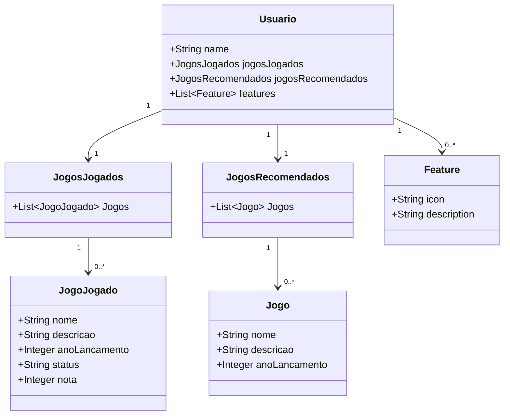

# Projeto Curriculo Gamer
Projeto para cadastrar seus jogos favoritos!

## Diagrama de Classes

```mermaid
classDiagram
    class Usuario {
        +String name
        +JogosJogados jogosJogados
        +JogosRecomendados jogosRecomendados
        +List~Feature~ features
    }

    class JogosJogados {
        +List~JogoJogado~ Jogos
    }

    class JogoJogado {
        +String nome
        +String descricao
        +Integer anoLancamento
        +String status
        +Integer nota
    }

    class JogosRecomendados {
        +List~Jogo~ Jogos
    }

    class Jogo {
        +String nome
        +String descricao
        +Integer anoLancamento
    }

    class Feature {
        +String icon
        +String description
    }

    %% Cardinalidades
    Usuario "1" --> "1" JogosJogados
    Usuario "1" --> "1" JogosRecomendados
    Usuario "1" --> "0..*" Feature
    JogosJogados "1" --> "0..*" JogoJogado
    JogosRecomendados "1" --> "0..*" Jogo

```
